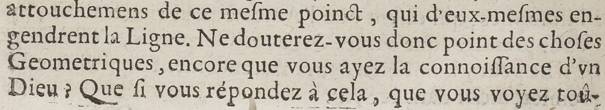
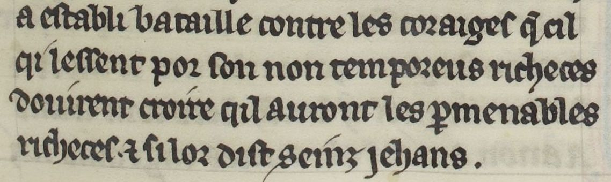

# `Default`

## Definition

**Default:** characterises any kind of standard text line, whether they are included in the `Main` text, in the `Margin`, in `MusicNotation`, or in any type of zone.

## Examples

## Subtypes

None

## Justification

The quintessential text line, on which usually rests the text that needs to be predicted.

## Problems and challenges

## Subtypes