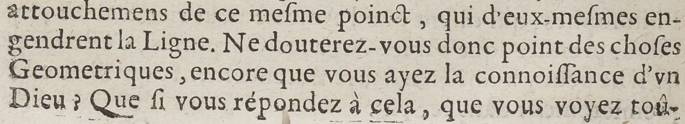
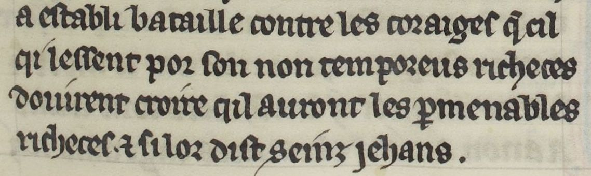

# `DefaultLine`

## Definition

**DefaultLine:** characterises any kind of standard text line, whether they are included in the `MainZone` text, in the `MarginZone`, in `MusicZone`, or in any type of zone.

## Subtypes

None

## Examples

## Justification

The quintessential text line, on which usually rests the text that needs to be predicted.

