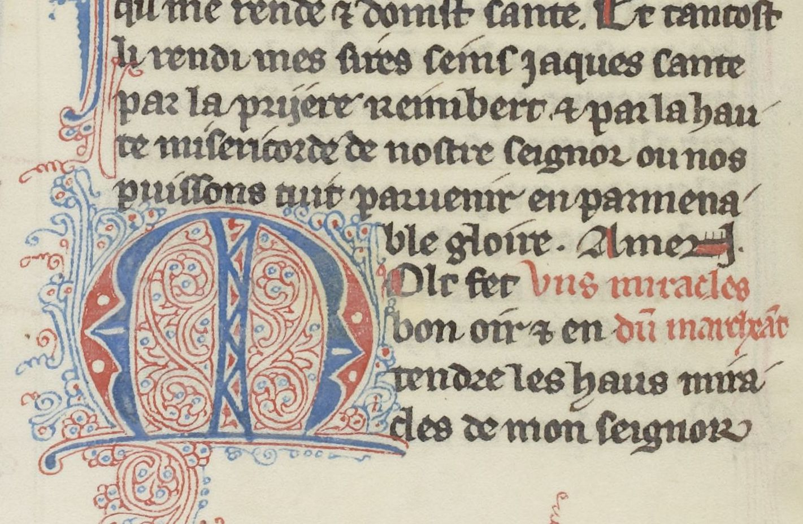

# `DropCapitalLine`

## Definition

**DropCapitalLine:** characterises a line on which rests a [`DropCapital`](https://github.com/SegmOnto/examples/tree/main/zones/DropCapital).

## Subtypes

None

## Examples

## Justification

Drop capitals are both specific zones, and bear a text.

## Problems and challenges

- Should this redundancy be avoided?

