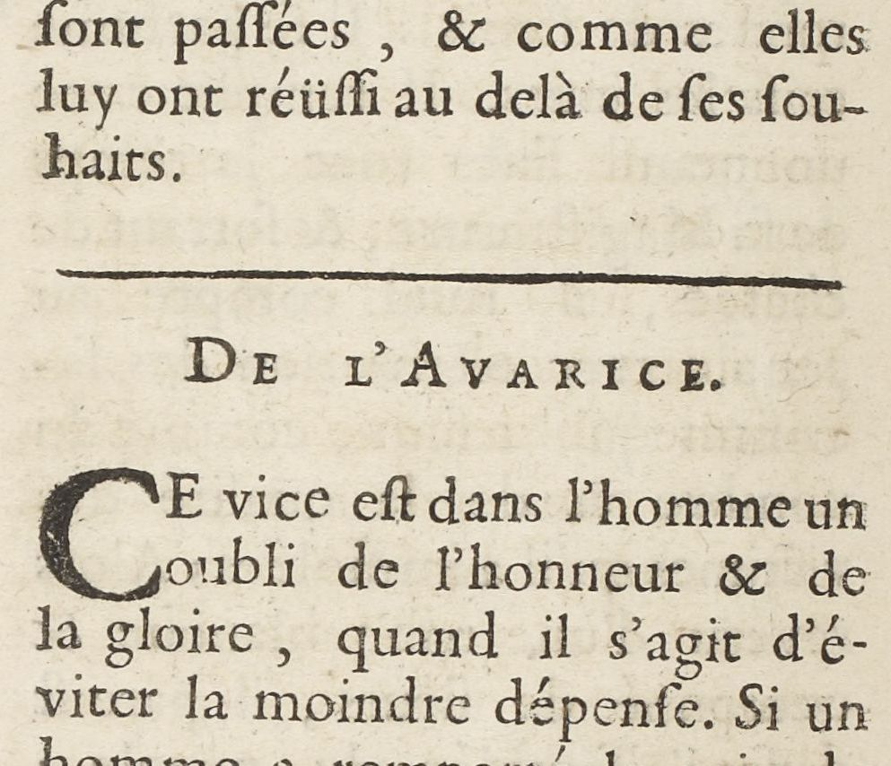

# `HeadingLine`

## Definition

**HeadingLine:** characterises a line containing a heading, for instance signalling the beginning of a new text. It is typically the case for rubrics in medieval manuscripts, or part/chapter titles in a book.

## Subtypes

Suggested values include:

- `HeadingLine:rubric`
- `HeadingLine:title`

## Examples

- `HeadingLine:rubric`

- `HeadingLine:title`

## Justification

Headings are usually distinguished through color (red ink), font size or casing from surrounding text. Rubrics sometimes do not fit in the same reading order as the surrounding text.

