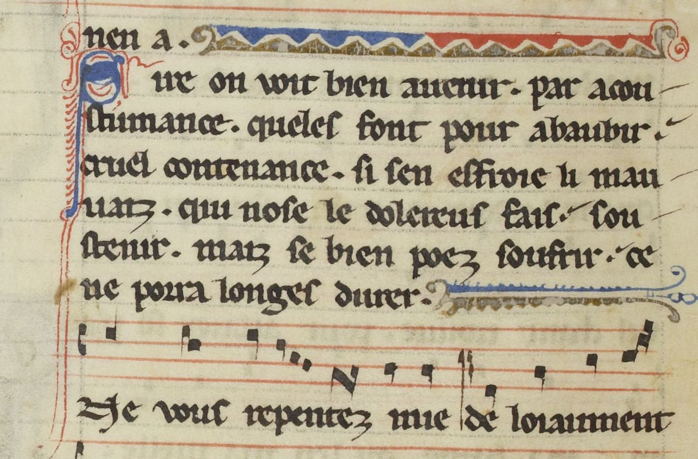

# `MusicLine`

## Definition

**MusicLine:** caracterises the central line of a musical stave.

## Examples

## Subtypes

None

## Justification

Analysis or prediction of musical content can be as necessary as the text's.

