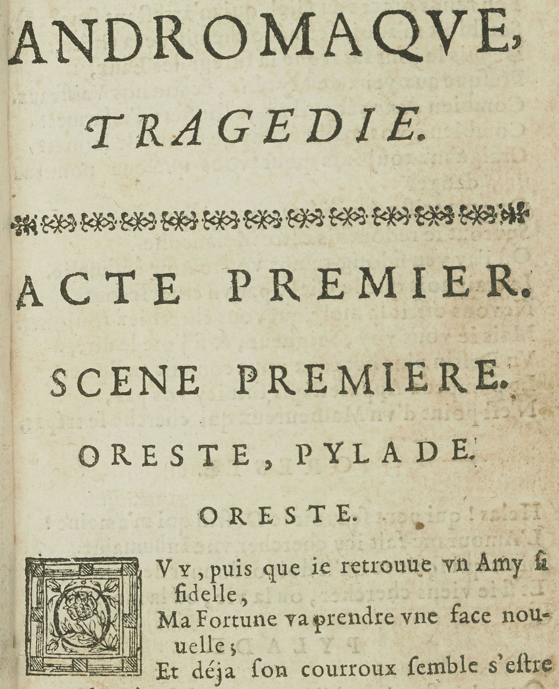
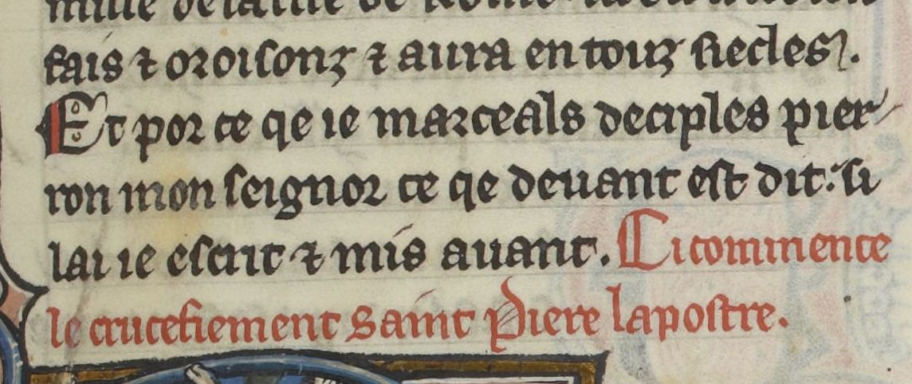

# `Rubric`

## Definition

**Rubric:** characterises a line containing a rubric, for instance signalling the beginning of a new text.

## Examples

## Subtypes

None

## Justification

Rubrics are usually distinguished through color (red ink) from surrounding text and sometimes do not fit in the same reading order as the surrounding text.

## Problems and challenges

Could we use rubrics to encode speakers in theatre plays (cf. https://gallica.bnf.fr/ark:/12148/btv1b8610799c/f20.item).
