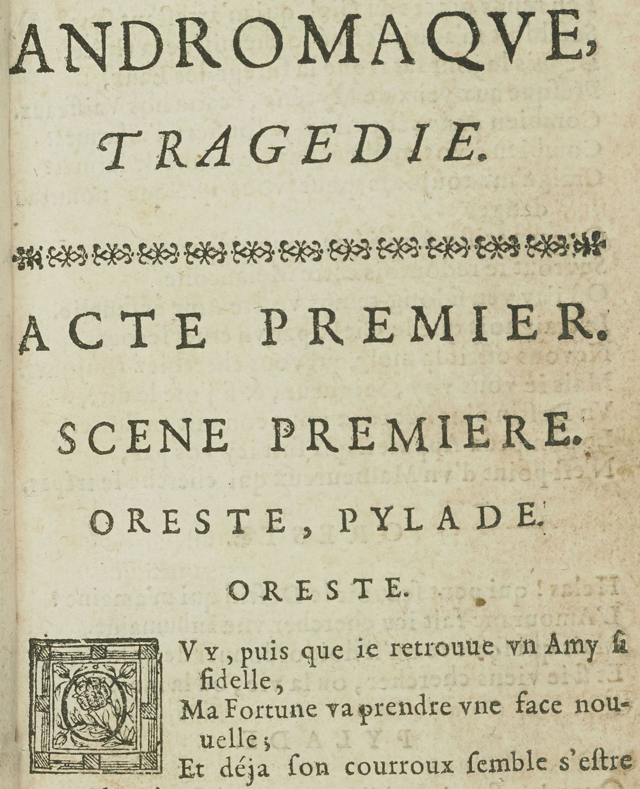

# `RubricLine`

## Definition

**RubricLine:** characterises a line containing a rubric, for instance signalling the beginning of a new text.

## Subtypes

Suggested values include:

- `RubricLine:incipit`
- `RubricLine:explicit`
- `RubricLine:title`

## Examples

## Justification

Rubrics are usually distinguished through color (red ink) from surrounding text and sometimes do not fit in the same reading order as the surrounding text.

