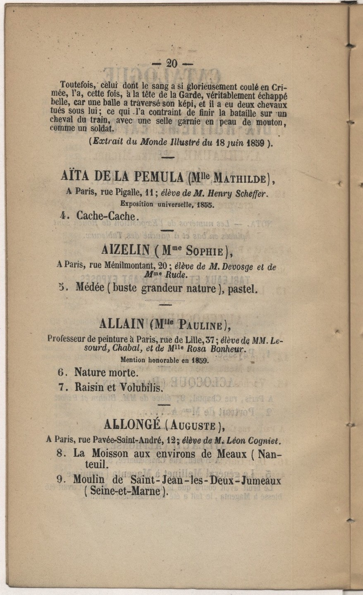

# `CustomZone`

## Definition

**CustomZone:** characterises any kind of zone not fitting in the other categories, according to any convenient typology the user chooses.

## Subtypes

Any

## Examples

Encoding catalogue entries with `CustomZone:entry#1`, `CustomZone:entry#2`,

## Justification

All projects have specific needs regarding types of zones peculiar to their sources or their goals and  not covered by the standard types.

