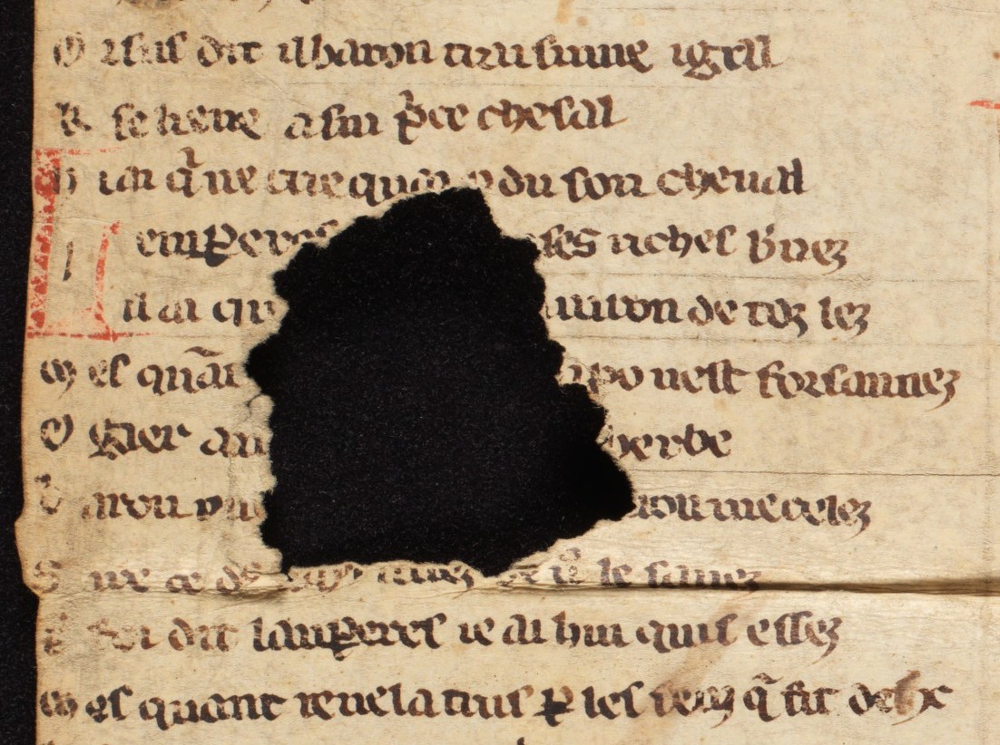

# `Damage`

## Definition

**Damage:** characterises any area containing damage to the source, such as holes in the material (parchment, paper…), blots, etc.

## Examples

## Subtypes

* `Damage:corrosion` (_corrosion_)
* `Damage:hole` (_trou_)
* `Damage:mold` (_moisissure_)
* `Damage:peeled` (_desquamé_)
* `Damage:soaked` (_détrempé_)
* `Damage:scuffed` (_eraillé_)
* `Damage:cockled` (_gondolé_)
* `Damage:hardened` (_durci_)
* `Damage:foxed` (_rouillé_)
* `Damage:discoloured` (_décoloré_)
* `Damage:stained` (_taché_)
* `Damage:charred` (_carbonisé_)
 
## Justification

Identifying damaged area might prove useful, as they can affect the result of text prediction.

## Problems and challenges

Should _restoration_ receive a type as well ?
