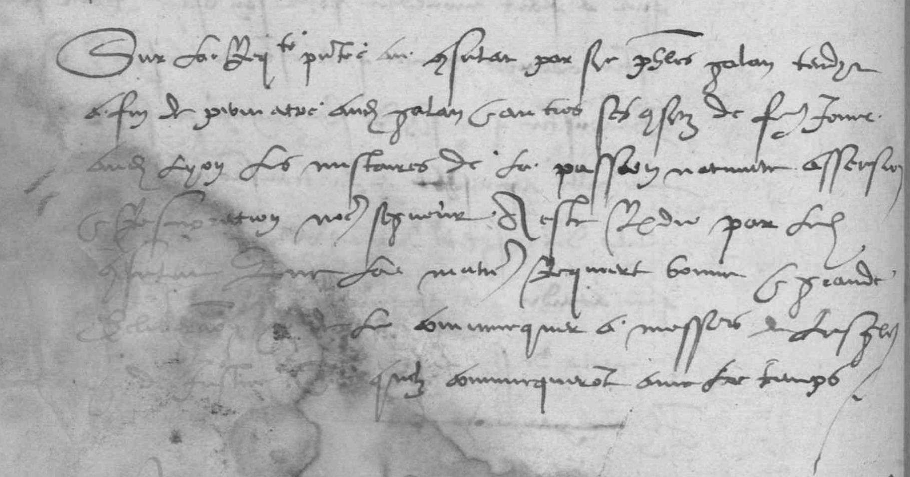

# `DamageZone`

## Definition

**DamageZone:** characterises any area containing damage to the source, such as holes in the material (parchment, paper…), blots, etc.

## Examples

## Subtypes

* `DamageZone:corrosion` (_corrosion_)
* `DamageZone:hole` (_trou_)
* `DamageZone:mold` (_moisissure_)
* `DamageZone:peeled` (_desquamé_)
* `DamageZone:soaked` (_détrempé_)
* `DamageZone:scuffed` (_eraillé_)
* `DamageZone:cockled` (_gondolé_)
* `DamageZone:hardened` (_durci_)
* `DamageZone:foxed` (_rouillé_)
* `DamageZone:discoloured` (_décoloré_)
* `DamageZone:stained` (_taché_)
* `DamageZone:charred` (_carbonisé_)
 
## Justification

Identifying damaged area might prove useful, as they can affect the result of text prediction.

