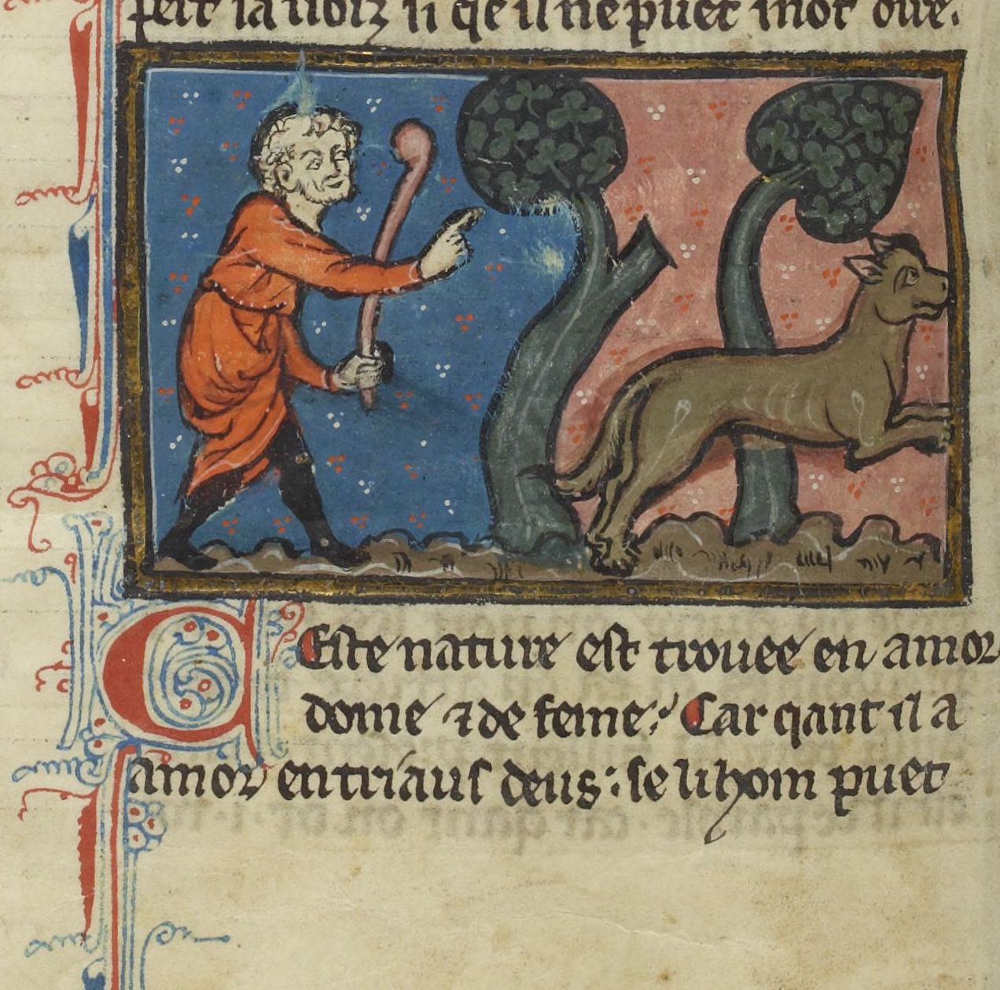
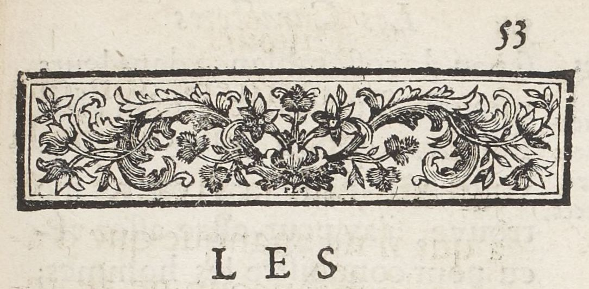

# `Decoration`

## Definition

**Decoration:** characterises a zone containing any type of decoration, from full page paintings to line-fillers and marginal drawings.

## Examples

## Subtypes

Suggested values include:

* `Decoration:illustration`
* `Decoration:ornamentation`

## Justification

Many sources contain either originally or from additions various element of decoration.

