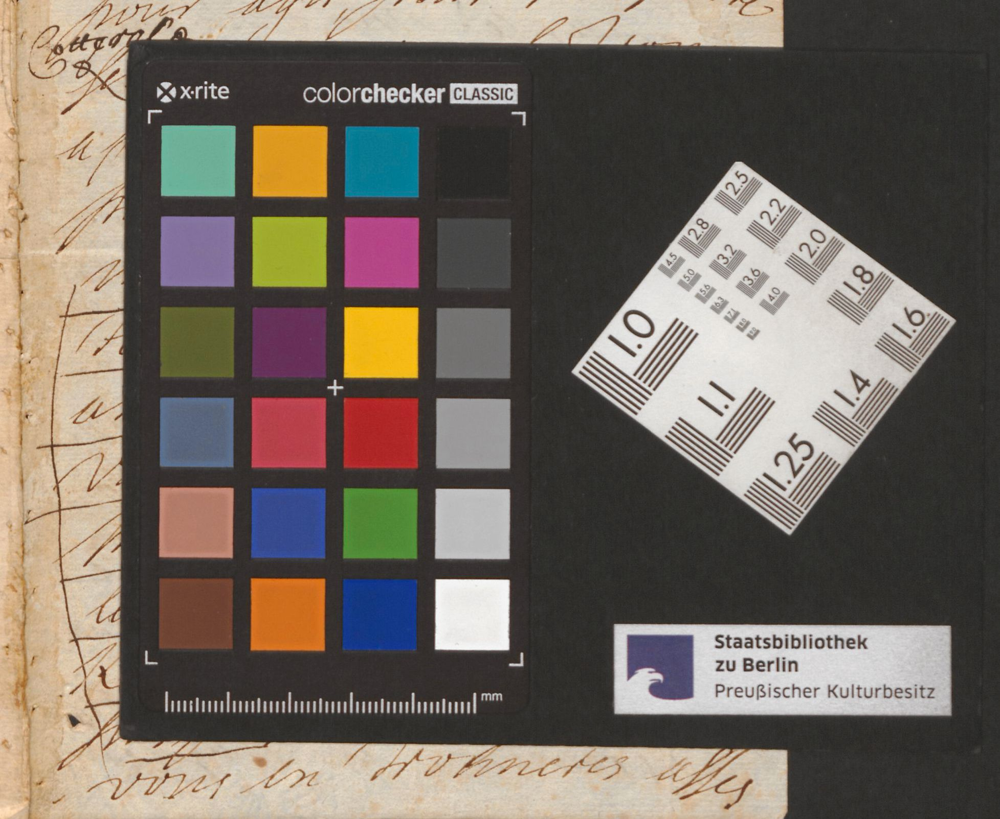

# `DigitizationArtefactZone`

## Definition

**DigitizationArtefactZone:** contains any type of item external to the document itself, but due to the process of digitisation, such as rulers or color tables added to help analyse the image.

## Subtypes

Suggested values include:

* `DigitizationArtefactZone:ruler`
* `DigitizationArtefactZone:testCard`

## Examples

* `DigitizationArtefactZone:testCard`

* `DigitizationArtefactZone:ruler`

## Justification

These kind of artefacts are quite common in digitised manuscripts, and need to be separated from the document itself.

