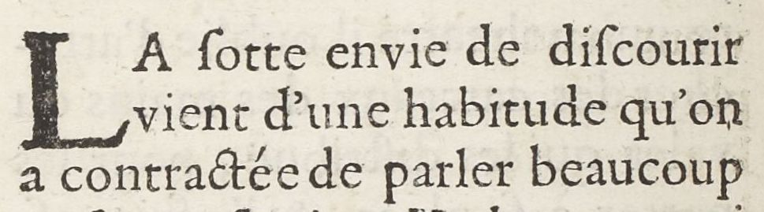

# `DropCapital`

## Definition

**Drop capital:** contains any type of initial letter, occupying a space corresponding to several lines of the main text or bearing significant ornementation, be they historiated, ornated, flourished or painted initials (and excluding the following text line).

## Examples

## Subtypes

* `DropCapital:historiated`
* `DropCapital:floriate`
* `DropCapital:flourish`
* `DropCapital:voided`
* `DropCapital:parted`
* `DropCapital:champ`
* `DropCapital:facetted`
* `DropCapital:plain`
* `DropCapital:interlocked`

## Justification

By their size, and the kind of ornamentation they can receive, such capitals often significantly differ from the surrounding text, and occupy a position intermediate between text and illustration.

## Problems and challenges

- Should they be treated separately or included as part of the line that they open ?
