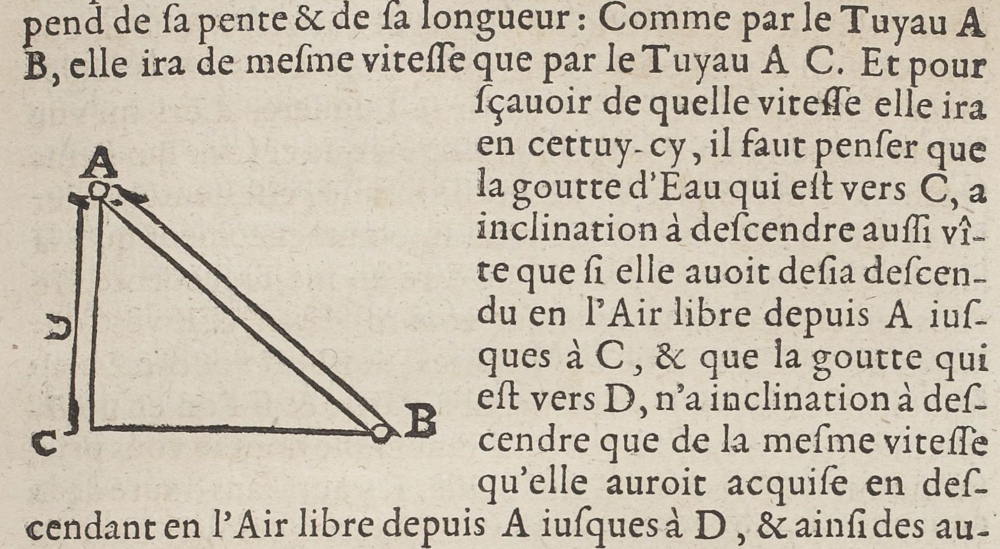
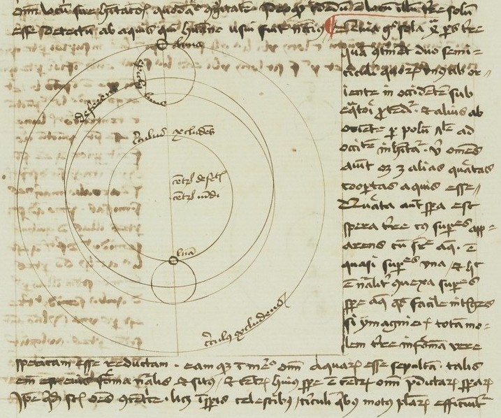

# `Figure`

## Definition

**Figure:** characterises a zone containing a figure.

## Examples

## Subtypes

None

## Justification

Figures, for instance in scientific sources, may have a different function that decoration.

## Problems and challenges

- Should figures be distinguished from decoration ?
- Exemple: https://raw.githubusercontent.com/SegmOnto/examples/propositionsDef/sources/ALFA-examples/Latin-7295A/f129.jpg

