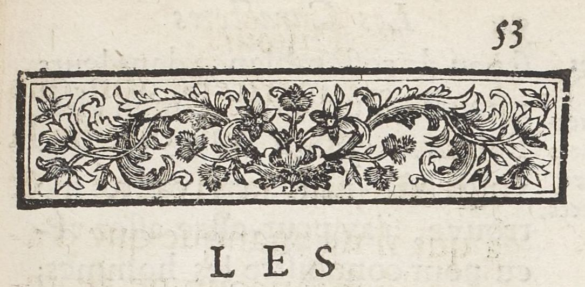

# `GraphicZone`

## Definition

**DecorationZone:** characterises a zone containing any type of graphic element, from purely ornamental  to consubstantial to the text (e.g., full page paintings, line-fillers, marginal drawings, figures, etc.).

## Subtypes

Suggested values include:

* `GraphicZone:illustration`
* `GraphicZone:ornamentation`
* `GraphicZone:figure`

## Examples

* `GraphicZone:illustration`

* `GraphicZone:ornamentation`

* `GraphicZone:figure`

## Justification

Graphic elements, be they decoration, figures or ornemented figures, are fairly common in the sources. 
Many of them contain either originally or from additions various element of decoration.
Figures, for instance in scientific sources, may have a different function that decoration, yet are not always clearly distinguished and can be often ornamented (especially in Medieval manuscripts).

