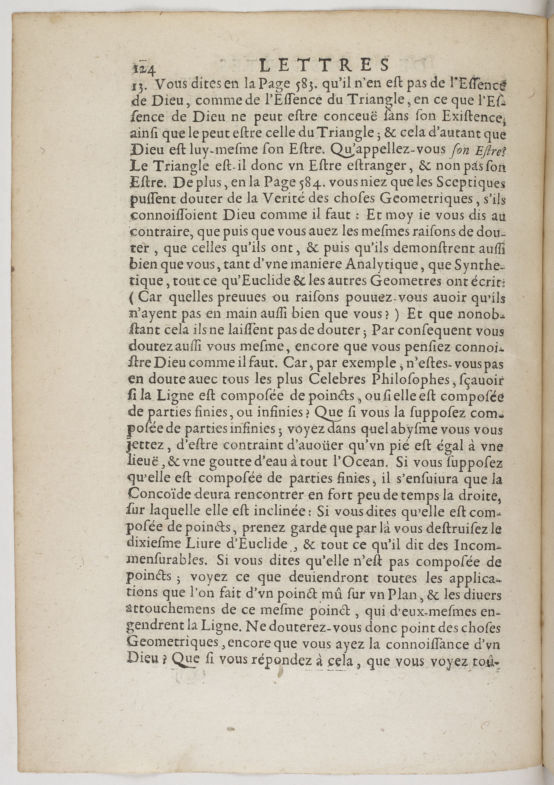

# `MainZone`

## Definition

**MainZone**: the main area (text column) designed to contain text, either as a single  or several columns (as designed in the conception of the layout: including eventually text, music notations, illumination, etc.).

## Subtypes

Suggested values include:

- `MainZone#column`

## Examples

- `MainZone:column#1` and `MainZone:column#1`

## Justification

The most essential type, characterising the most central element of the page.

In the case of layout with several columns, the use of a single type can create problems with some implementations of layout analysis algorithms, especially if their is a non empty intersection of the zones, hence the subtypes.

