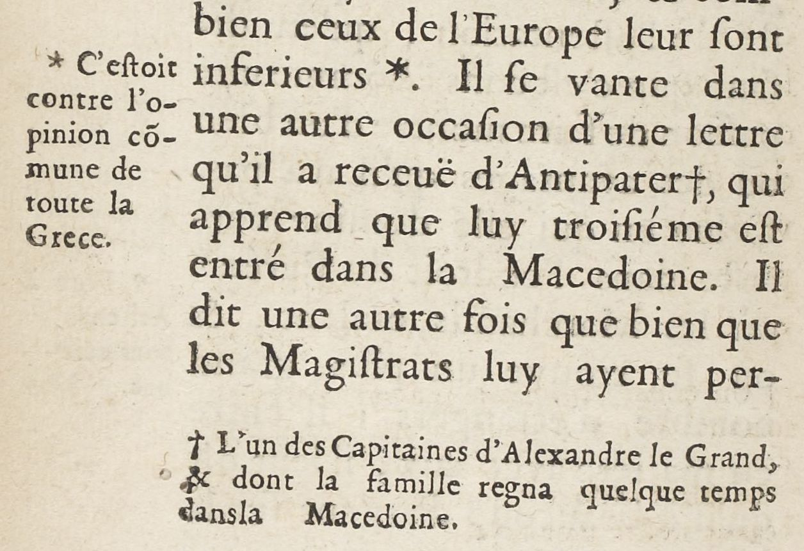
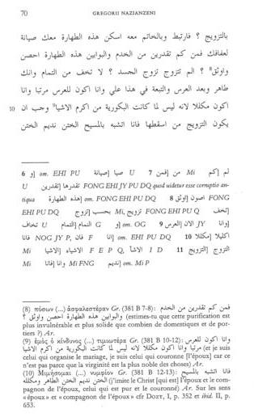

# `MarginTextZone`

## Definition

**MarginTextZone:** characterises any **text zone** contained in the margins (upper, lower, inner or outer), including the space between two columns, whatever their semantic status (gloss, additions, …).

## Subtypes

Suggested values include:

* `MarginTextZone:note`
* `MarginTextZone:commentary`
* `MarginTextZone:correction`
* `MarginTextZone:variants`

## Examples

* `MarginTextZone:variantes`  `MarginTextZone:note`)

## Justification

Distinguishing between Main and Marginal text, though limited from a semantic point of view, is a practical approach.

