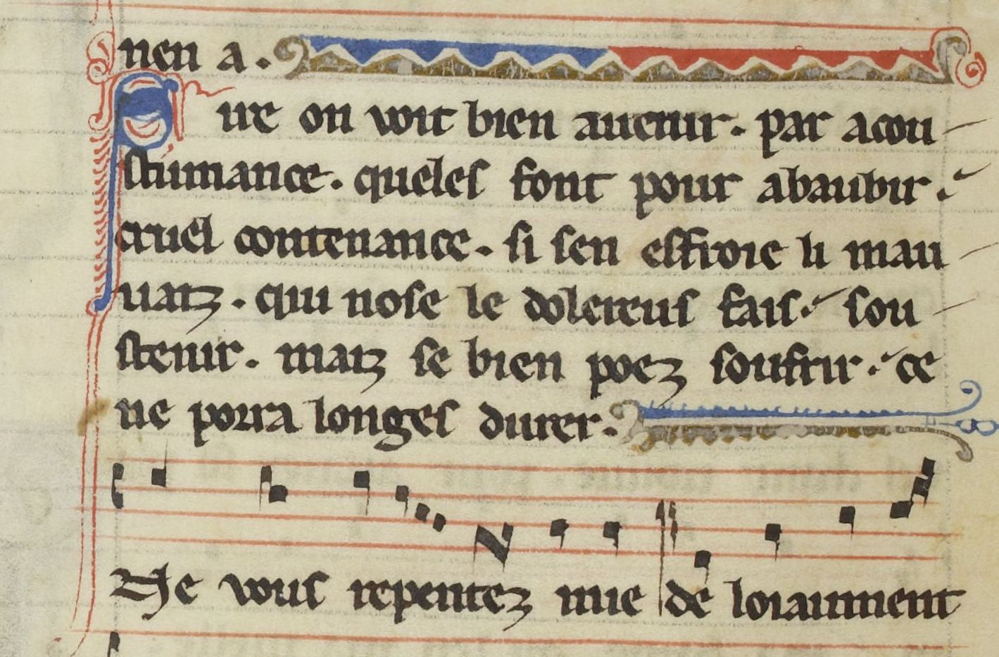

# `MusicZone`

## Definition

**MusicZone:** characterises an area containing musical notations, such as neumes, staves, etc., with the possible inclusions of text.

## Examples

## Subtypes

None

## Justification

Musical notations are of many types in sources from medieval up to modern sources. They can include both the musical notation themselves and sometimes text.

