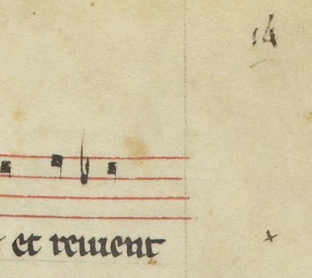
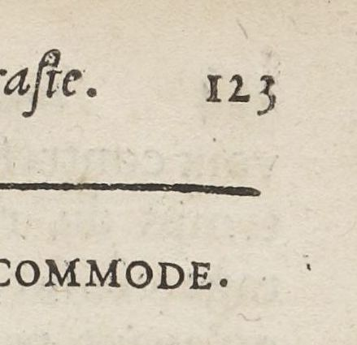

# `NumberingZone`

## Definition

**NumberingZone:** characterises a zone containing the page number.

## Examples

## Subtypes

* `NumberingZone:page`
* `NumberingZone:other`

## Justification

It might make sense to be able to retrieve specifically the page number.

