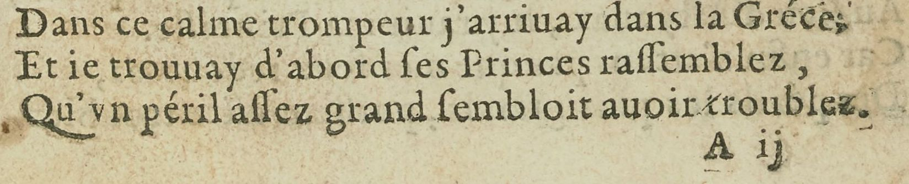

# `QuireMarks`

## Definition

**QuireMarks:** characterises a zone containing a quire signature (i.e., _a ii_), catchword, or any kind of element relative to the material organisation of the source, with the exclusion of page numbers.

## Examples

## Subtypes

* `QuireMarks:signature`
* `QuireMarks:catchwords`

## Justification

Many sources contain elements relative to the material fabrication of itself. 
Like page numbers or running titles, they should not be considered part of the text itself.

