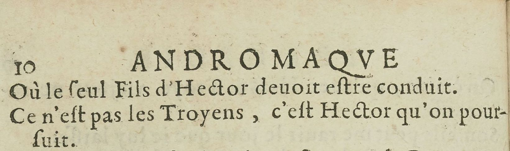
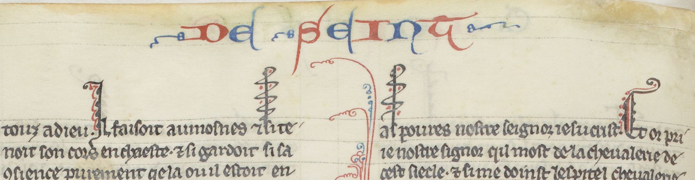

# `RunningTitleZone`

## Definition

**RunningTitleZone:** characterises a zone containing a running title.

## Subtypes

None

## Examples

## Justification

Running title is an element of layout attested since the end of the Antiquity. 

