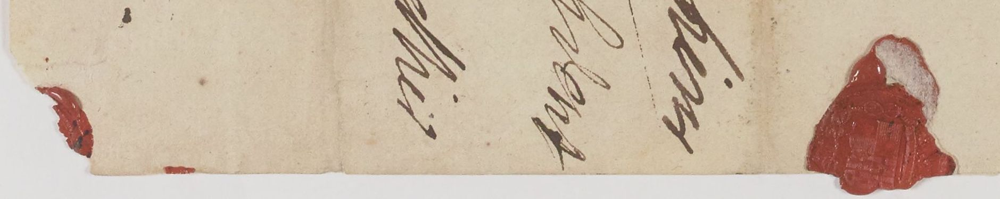
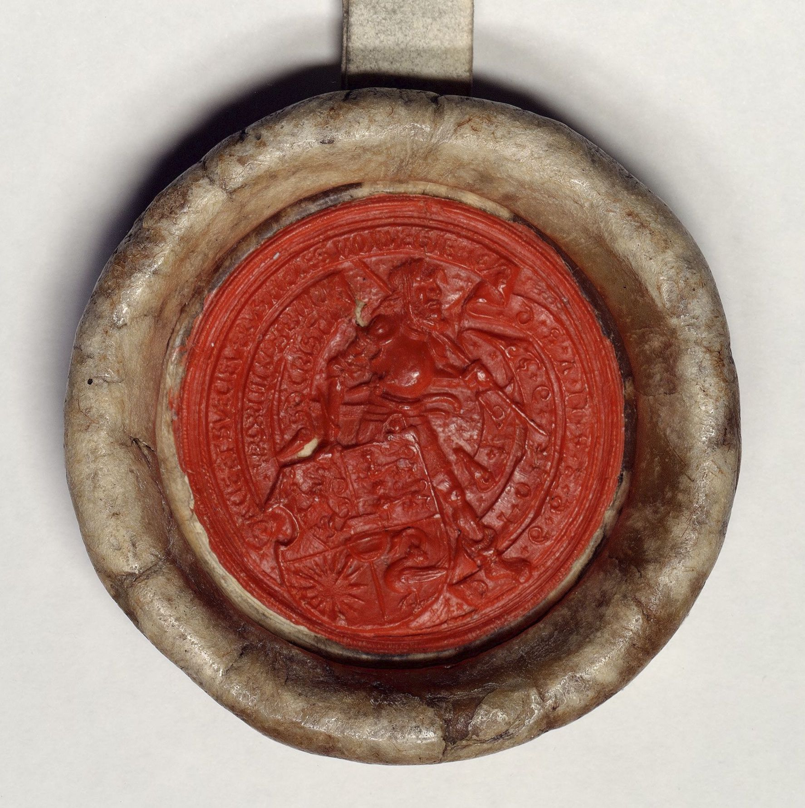

# `Seal`

## Definition

**Seal:** characterises a zone containing a seal.

## Examples

## Subtypes

None

## Justification

Seals are common in a variety of legal and everyday sources (letters, etc.). Contrarily to stamps, that often are posterior marks of possession by libraries and cultural heritage institutions, they usually are original and inserted by the sender of the document.

