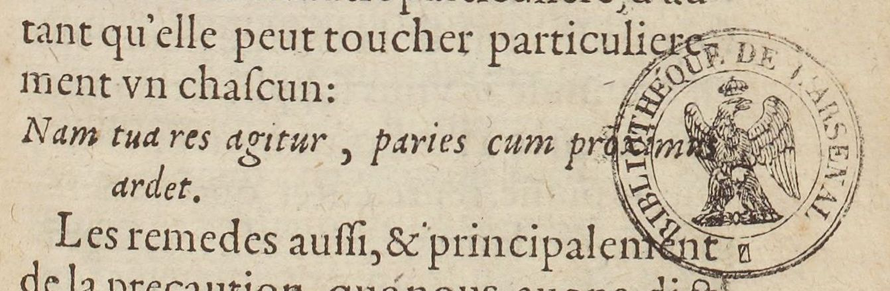
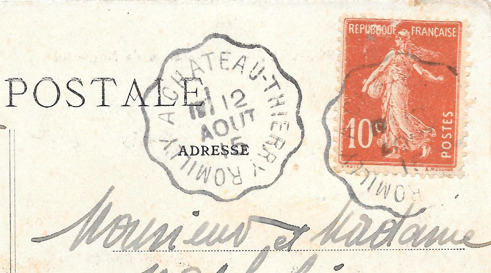

# `StampZone`

## Definition

**StampZone:** characterises a zone containing a stamp, be it a library stamp or a mark from a postal service.

## Subtypes

Suggested values include:

* `StampZone:postal`
* `StampZone:curatorial`

## Examples

* `StampZone:postal`

* `StampZone:postal`

## Justification

Stamps are common marks of possession, for instance by libraries, and are also used in a variety of situations.

