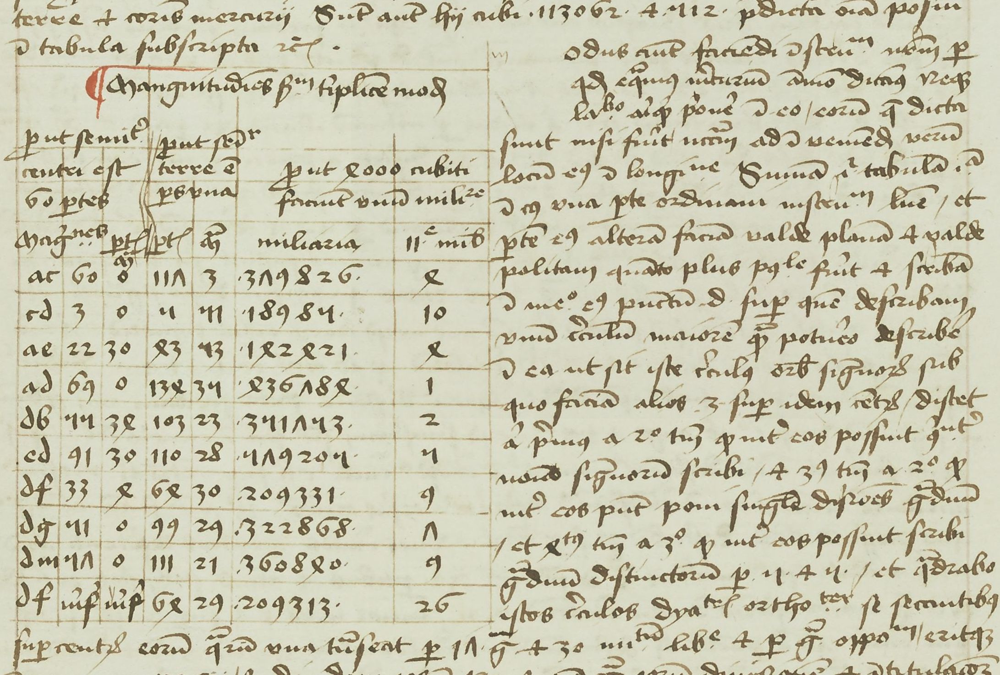

# `Table`

## Definition

**Table:** characterises a zone containing a table of any kind.

## Examples

## Subtypes

None

## Justification

Tables are fairly common, and their reading order may substantially differ from surrounding text.

## Problems and challenges

∅
