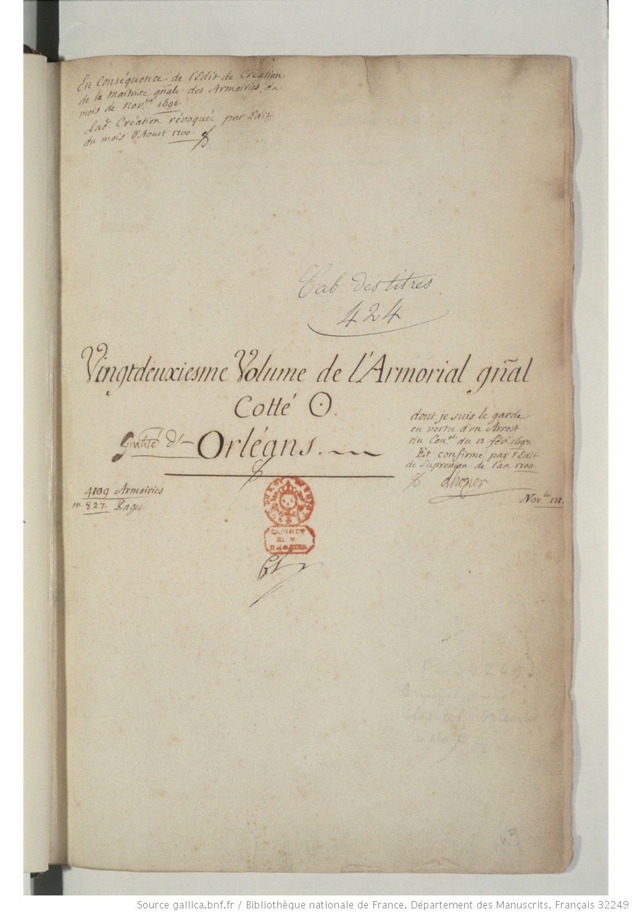

# `TitlePage`

## Definition

**TitlePage:** characterises a zone containing a title distinct from the main text. It is mainly used for prints.

## Examples

## Subtypes

None

## Justification

∅

## Problems and challenges

∅
