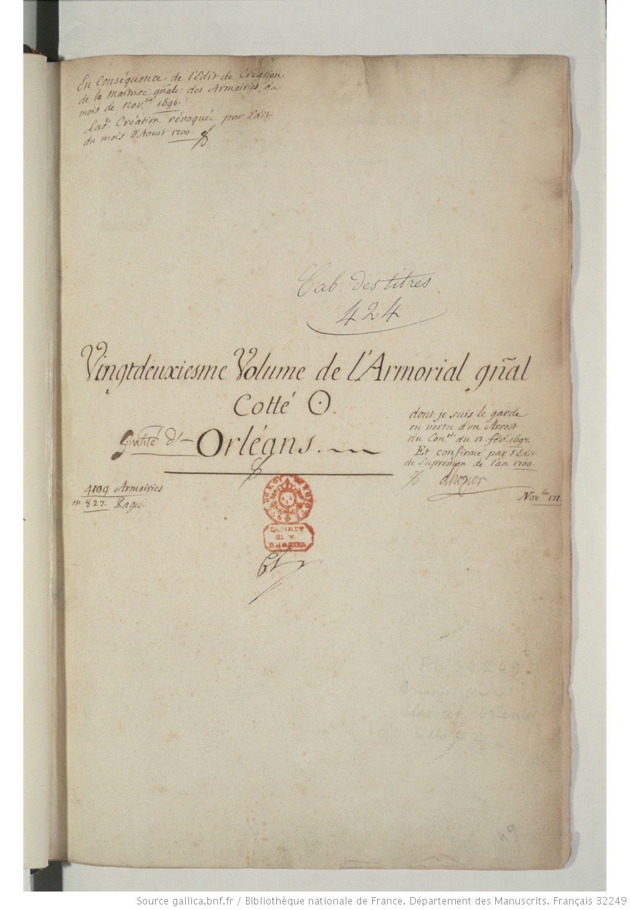

# `TitlePageZone`

## Definition

**TitlePageZone:** characterises a zone containing a title distinct from the main text. It is mainly used for prints.

## Subtypes

None

## Examples

## Justification

Important for prints because it includes a lot of metadata, and easy to retrieve.

## Problems and challenges

∅
